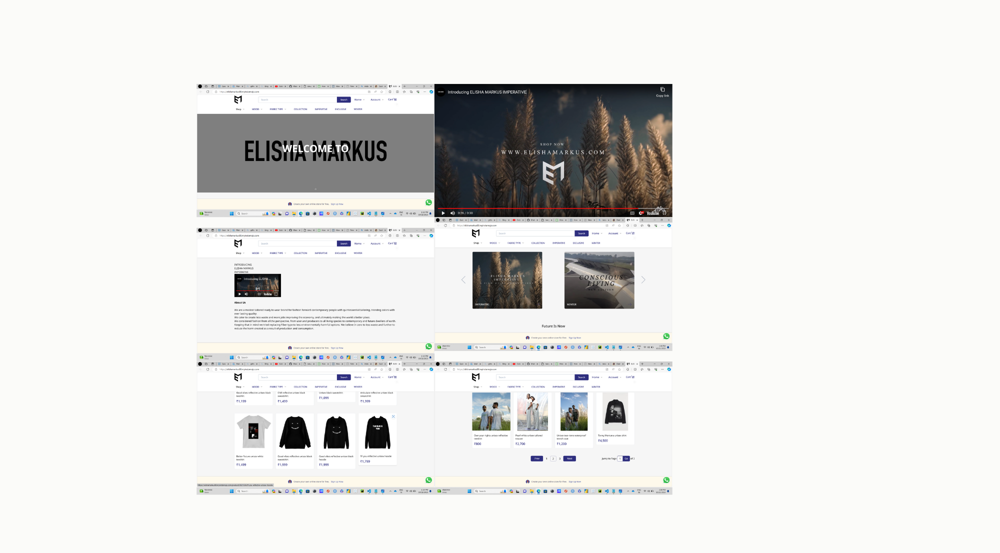
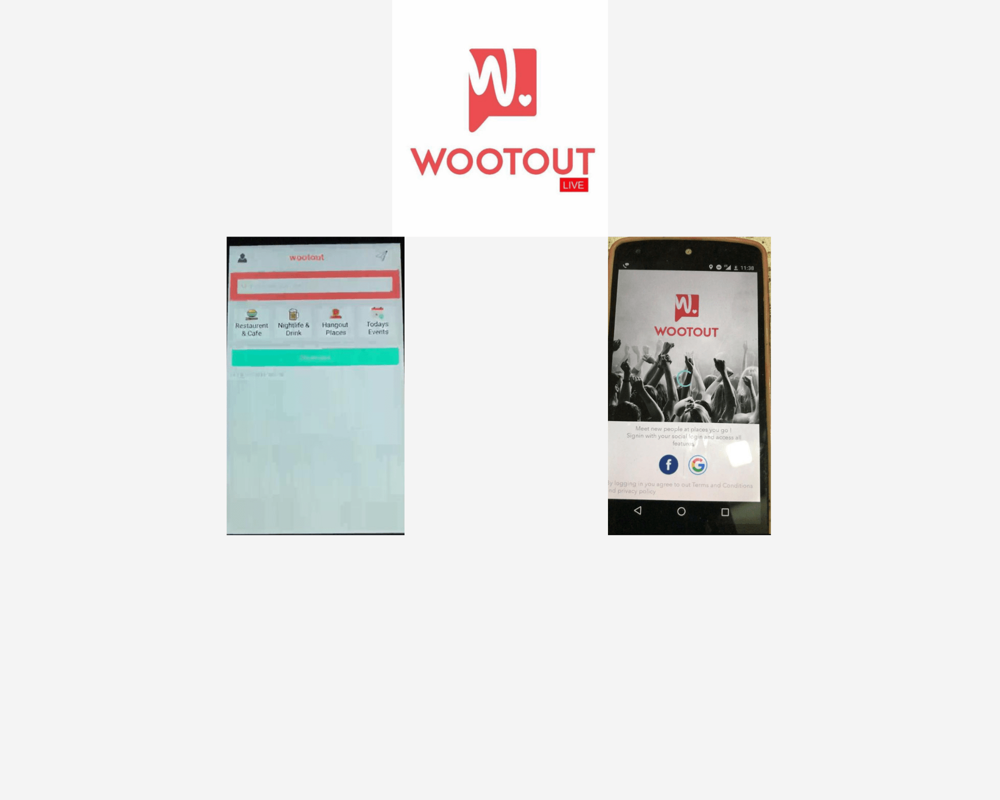

# Portfolio

 

 Welcome to My Data Science Journey!
## About Me
Hello, I'm Elisha Damor, a dedicated data science enthusiast currently pursuing a degree in Business Analytics with a focus on data science. I'm passionate about the potential of data to drive insights and inform decision-making.

With a strong foundation in Data Science and a growing interest in data science, I'm excited to share my progress and projects as I work towards becoming a data scientist.

## Interests and Aspirations
I'm particularly interested in Machine Learning and Deep Learning, and I'm eager to delve deeper into topics such as Supervised Learning and Generative Adversarial Networks. I aspire to leverage data-driven solutions to tackle real-world challenges, and I'm committed to continuous learning and growth in the field of data science.

## Skills and Tools
While I'm still in the process of honing my data science skills, here are some of the tools and technologies I'm actively working with:
- Programming Languages: Python, SQL, R, SAS
- Big Data and Machine Learning: Data Analysis Tools: Pandas, Matplotlib, Seaborn, 
- Machine Learning Libraries: Scikit-Learn,XGBoost, TensorFlow, Neural Networks, Clustering, Decision Trees, Random Forest
- Statistical Analysis: Hypothesis Testing, Regression Analysis, Time Series Analysis, A/B Testing, ANOVA 
- Big Data Technologies:Hadoop, Spark, Snowflake, Database Management Systems: SQL Server, MySQL
- Data Visualization & BI Tools: Tableau, Power BI, MS Excel, ggplot2 
- Cloud Platforms: AWS, Google Cloud Platform, Microsoft Azure
- Data Processing & ETL: Data Cleaning, Data Wrangling, Data Preprocessing, ETL Processes,Design Thinking, Agile development methodology
- Other Relevant Skills: Business Requirements Gathering, Communication & Presentation, Team Collaboration, Problem-Solving, Critical Thinking, Web Scraping.
- Project Management Tools:Jira

## Projects

### Customer Sentiment Analysis and Product Recommendation System for E-commerce Platforms

- This project aims to develop an intelligent e-commerce platform that utilizes customer sentiment analysis and product recommendation algorithms to enhance customer experience and boost sales.
- [Link to Project Repository](Link to Project Repository)

### Online Retail Analysis: Understanding Consumer Behavior and Advertisement Effectiveness

- Analyzing customer behavior and the effectiveness of advertisements in an online retail context using SQL queries in R.
(https://github.com/ElishaD17/Online-Retail-Analysis)

### US Arrests Clustering: Exploring Crime Rates with K-Means and Hierarchical Techniques

- Utilizing K-Means and Hierarchical clustering techniques to explore crime rates in the United States using R.
(https://github.com/ElishaD17/US-Arrests-Analysis)

### Optimizing Citi Bike Stocking: Descriptive, Prescriptive & Predictive Analytics

- Applying descriptive, prescriptive, and predictive analytics in R to maximize bike trips for Citi Bike.
(https://github.com/ElishaD17/Optimizing-Citi-Bike-Stocking)

### Analyzing Purchase Behavior and Survival Analysis

- Analyzing purchase behavior and performing survival analysis using Minitab & Excel Analytics.
- [Link to Project Repository](Link to Project Repository)

### Gender Pay Gap Analysis Across Job Titles

- Investigating gender-based salary differences across job titles using Tableau.
- [Link to Project Repository](Link to Project Repository)

### Employee Flight Data Analysis

- Cleaning and visualizing employee flight data using Power BI.
- [Link to Project Repository](Link to Project Repository)

### Decoding Airbnb Pricing Patterns in Chicago

- Using regression analysis and machine learning insights in SAS to understand Airbnb pricing patterns in Chicago.
https://github.com/ElishaD17/Decoding-Airbnb-Pricing-Patterns-in-Chicago

### Data Analysis of COVID-19 Trends in Wisconsin

- Analyzing COVID-19 trends in Wisconsin using descriptive, clustering, and predictive modeling in SAS.
- [Link to Project Repository](Link to Project Repository)

### Real Estate Valuation in 1970s Boston

- Leveraging Python libraries like Pandas, Numpy, Seaborn, Plotly, Matplotlib, and Scikit-learn to analyze real estate valuation in 1970s Boston.
- [Link to Project Repository](Link to Project Repository)

## Professional Experience
**Business Analyst | Webcraft-IT**  
  
  
  Played a vital role in projects, improving efficiency by 15% and reducing project timelines by 10%.
  Proficiently enhanced database design and API development, leading to a 20% boost in database efficiency and a 12% improvement in API functionality.
  Effectively led diverse project teams, fostering a 25% improvement in cross-functional collaboration and a 17% increase in project success rates.
  Experienced rapid career progression from an Associate Business Analyst to the role of Module Lead within seven months, contributing to a 30% increase in team 
  performance and staff training.
  July 2017 - November 2022

 **Entrepreneur | Print on Demand/Sustainable Clothing Venture**
  
  
  Founded a profitable online sustainable clothing store, reducing overhead by 50% and increasing revenue by 100%. Managed daily operations, supervised and 
  trained a team of 5 employees with full retention, and executed successful product promotion across various channels. Oversaw the entire product development 
  process, from research and design to delivery, and expanded the business through strategic pop-up shop placements, achieving break-even in just 1 year and 4 
  months.
  August 2021 - December 2022
  
 **Entrepreneurship | WootOut-Website and Mobile Application**  
  
  
  "Let's you connect with people in the same area"  
  2014 - 2015
## Education

**Master of Science (MS) in Business Analytics, Specialization: Data Science**  
DePaul University | Expected Graduation: November 2024  
Relevant Coursework: Data Mining and Machine Learning, Statistical Analysis and Modeling, Advanced Python Programming, Data Visualization, Database Management, Business Analytics for Decision-Making  
Current GPA: 4.0/4.0

**Bachelor of Business Administration (BBA)**  
Devi Ahilya Vishwa Vidhyalaya | 2014-2017  
Relevant Coursework: Statistics, Management  
GPA: 3.6/4.0

## Let's Connect!
I'm always open to discussions, collaborations, and learning opportunities. Feel free to reach out to me via:

- Portfolio: [elishad17.github.io](https://elishad17.github.io)
- GitHub: [github.com/ElishaD17](https://github.com/ElishaD17)
- Mobile: +18728106708
- LinkedIn:(https://www.linkedin.com/in/elisha-damor-573a6175)

Let's connect and explore the exciting journey of data science together!
